# 08-1 장치 컨트롤러와 장치 드라이버

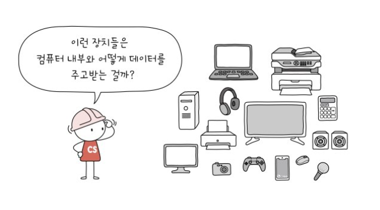

<aside>
❓ 입출력 장치가 컴퓨터와 연결될 때 발생할 수 있는 어려움에는 어떤 것들이 있을까?

</aside>

1. 입출력 장치는 종류가 너무 다양하기 때문에 정보를 주고받는 방식을 규격화하기가 어려움
    
    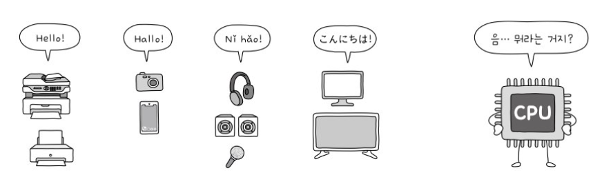

    
2. 일반적으로 CPU와 메모리의 데이터 전송률은 높지만 입출력장치의 데이터 전송률은 낮기 때문에 서로 통신을 하기가 어려움
    
    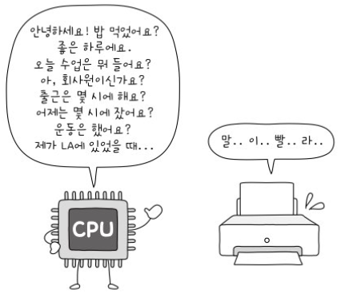
    

<aside>
💡 이러한 문제들을 해결하기 위해 등장한 것이 바로 **장치 컨트롤러**

</aside>

## 장치 컨트롤러

: **컴퓨터 내부와 입출력 장치를 연결하는 하드웨어**

### **장치 컨트롤러의 역할**

1. **CPU와 입출력장치 간의 통신 중개**
2. **오류 검출**
3. **데이터 버퍼링**

<aside>
📌 버퍼링

전송률이 높은 장치와 낮은 장치 사이에 주고받는 데이터를 버퍼(buffer)라는 임시 저장 공간에 저장해 전송률을 비슷하게 맞추는 방법

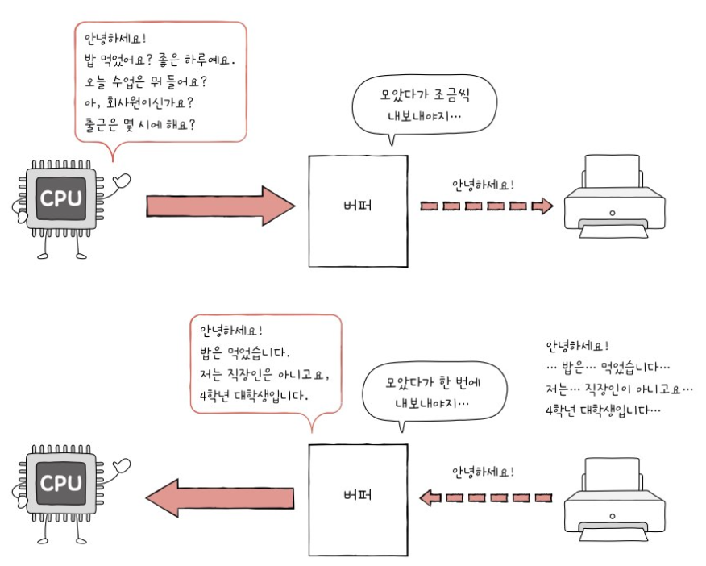

</aside>

<aside>
💡 장치 컨트롤러에서는 일반적으로 전송률이 높은 CPU와 전송률이 낮은 입출력장치 사이의 전송률 차이를 `데이터 버퍼링`으로 완화함

</aside>

### **장치 컨트롤러의 내부**

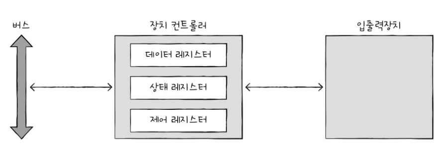

1. **데이터 레지스터**
    - CPU와 입출력장치 사이에 주고받을 데이터가 담김
    - 버퍼 역할
    - 주고받는 데이터가 많은 입출력장치에서는 데이터 레지스터 대신 RAM을 대신 사용하기도 함
2. **상태 레지스터**
    - 입출력 장치의 상태 정보가 저장됨
3. **제어 레지스터**
    - 입출력 장치가 수행할 내용에 대한 제어 정보와 명령을 저장함

## 장치 드라이버

: **컴퓨터 내부와 입출력 장치를 연결하는 소프트웨어(프로그램)**

- 새로운 장치를 컴퓨터에 연결하기 위해서는 해당 장치의 드라이버를 설치해야함
- 컴퓨터가 연결된 장치의 드라이버를 인식하고 실행할 수 있다면 해당 장치는 컴퓨터 내부와 정보를 주고받을 수 있음
- 장치 드라이버는 운영체제가 인식함

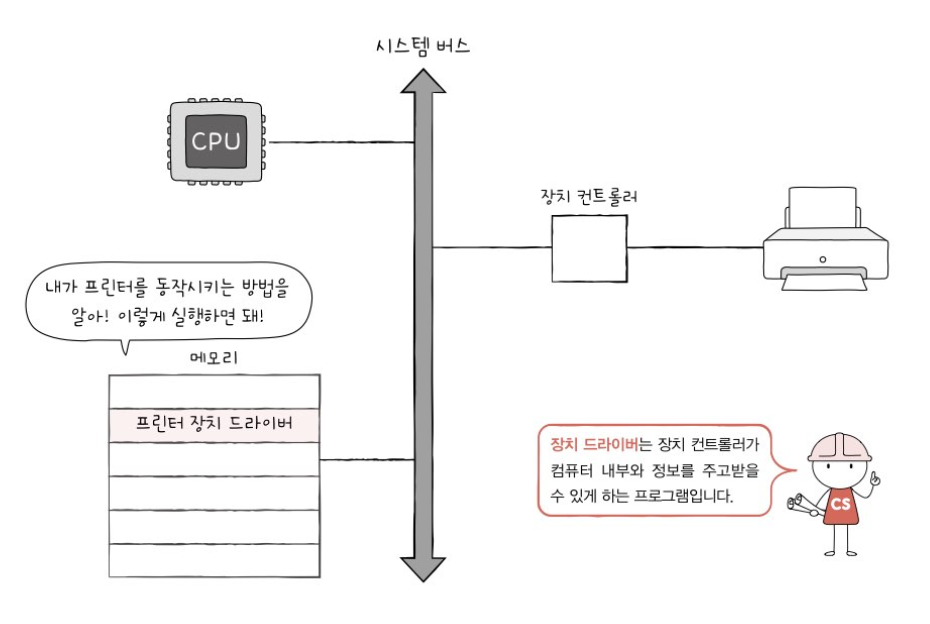

<aside>
✅ 입출력 장치는 직접 컴퓨터 내부와 연결되지 않고, 장치 컨트롤러를 통해 연결된다.

</aside>

# 08-2 다양한 입출력 방법

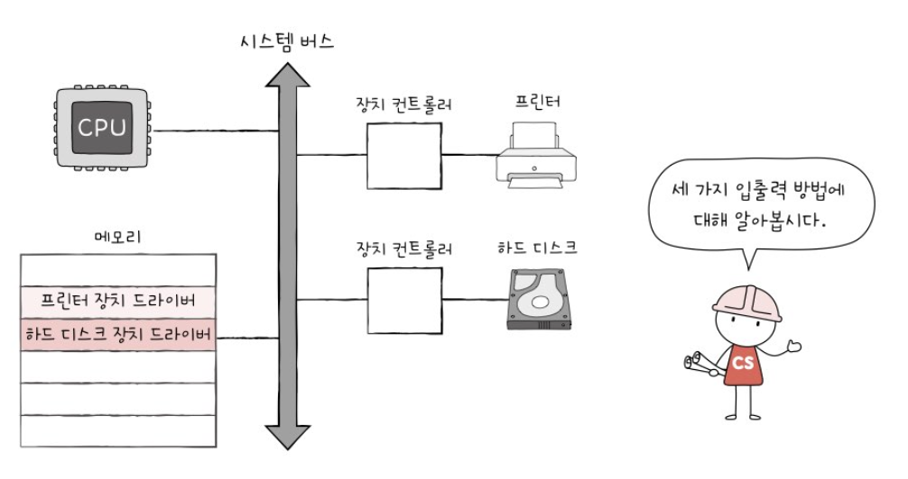

<aside>
❓ 장치 컨트롤러는 CPU와 어떻게 정보를 주고받을까?

</aside>

## 1. 프로그램 입출력

: CPU가 프로그램 속 명령어에 따라 입출력 작업을 수행하는 방식이다.

ex. 메모리에 저장된 정보를 하드 디스크에 백업하는 상황

⇒ `하드 디스크에 새로운 정보를 쓴다`

1. CPU는 하드 디스크 컨트롤러의 제어 레지스터에 쓰기 명령을 보낸다.

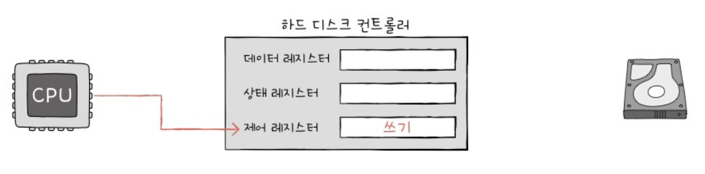

1. 하드 디스크 컨트롤러는 하드 디스크 상태를 확인하고, 하드 디스크가 준비된 상태라면 상태 레지스터에 준비되었다고 표시한다.

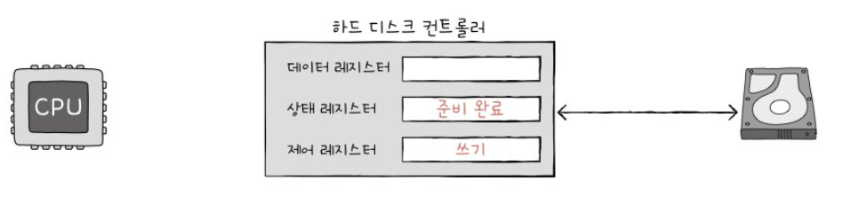

1. CPU는 상태 레지스터를 주기적으로 읽으면서 하드 디스크가 준비되었는지 확인한다. 확인했을 때 하드 디스크가 준비된 상태라면 백업할 메모리의 정보를 데이터 레지스터에 쓴다.

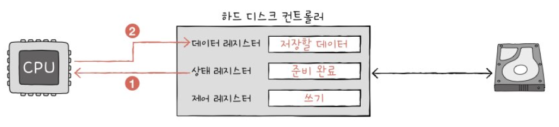

1. 쓰기 작업이 끝났다면(3번 과정에서 데이터 레지스터에 쓴 정보가 마지막 정보라면) 작업을 종료하고, 아직 쓰기 작업이 끝나지 않았다면 다시 1번 과정부터 반복한다.

<aside>
❓ CPU가 다음과 같은 명령어들을 실행하려면 컨트롤러의 레지스터들의 주소를 알아야하는데, 그 주소들은 메모리에 어떻게 저장되어 있을까?

</aside>

- 프린터 컨트롤러의 상태 레지스터를 읽어라.
- 프린터 컨트롤러의 데이터 레지스터에 100을 써라.
- 키보드 컨트롤러의 상태 레지스터를 읽어라.
- 하드 디스크 컨트롤러의 데이터 레지스터에 ‘a’를 써라.

<aside>
💡 컨트롤러의 레지스터들의 주소를 저장하는 방식에는 `메모리 맵 입출력`, `고립형 입출력` 두 가지 방식이 있다.

</aside>

### 1. 메모리 맵 입출력

: 메모리를 위한 주소 공간과 입출력장치를 위한 주소 공간을 하나의 주소 공간으로 간주하는 방법이다.

- 메모리의 주소들이나 컨트롤러 레지스터들이나 모두 똑같이 메모리 주소를 대하듯이 하면 된다.
- 그래서 메모리에 접근하는 명령어와 입출력 장치에 접근하는 명령어가 같다.

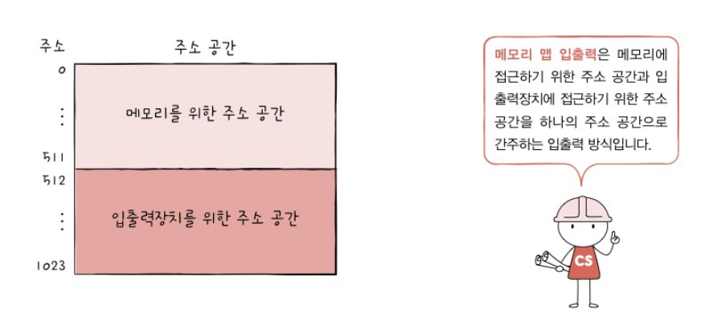

### 2. 고립형 입출력

: 메모리를 위한 주소 공간과 입출력장치를 위한 주소 공간을 분리하는 방법이다.

- 아래 그림처럼 제어 버스에 메모리에 접근하는 선과 입출력장치에 접근하는 선을 따로 둬서 각각의 주소 공간을 활용하는 방식이다.
- CPU는 메모리에 접근하는 선이 활성화 될 때 메모리에 접근하고, 입출력 장치에 접근하는 선이 활성화 될 때 입출력 장치에 접근한다.
- 그래서 메모리에 접근하는 명령어와 입출력장치에 접근하는 명령어가 다르다.

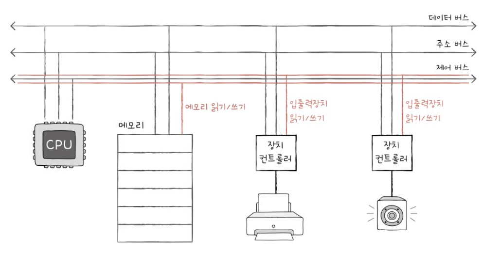

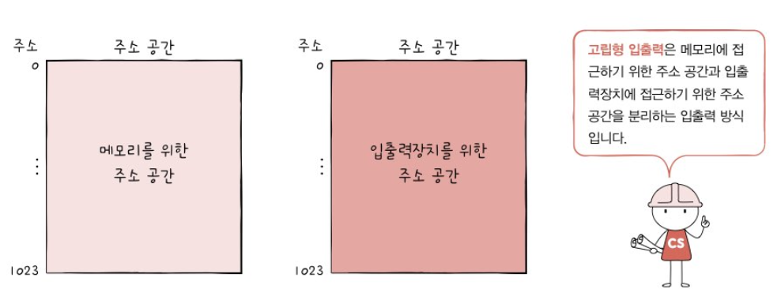

<aside>
✅ 메모리 맵 입출력 vs 고립형 입출력

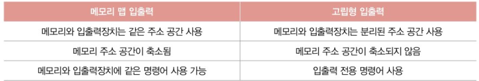

</aside>

## 2. 인터럽트 기반 입출력

: 장치 컨트롤러에서 보낸 하드웨어 인터럽트 요청을 기반으로 입출력 작업을 수행하는 방식이다.

1. CPU는 장치 컨트롤러에게 입출력 작업을 명령하고, 장치 컨트롤러가 입출력을 수행하는 동안 다른 일을 할 수 있다.

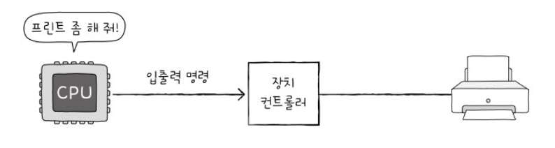

1. 장치 컨트롤러가 입출력 작업을 끝낸 뒤 CPU에게 인터럽트 요청 신호를 보내면 CPU는 하던 일을 잠시 백업하고, 인터럽트 서비스 루틴을 실행한다.

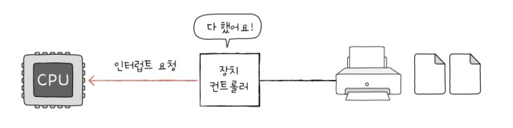

<aside>
✅ 인터럽트 vs 폴링

- 인터럽트 방식은 CPU가 인터럽트 요청을 받을 때까지 온전히 다른 일에 집중할 수 있지만,
- 폴링 방식은 CPU가 주기적으로 컨트롤러의 상태 레지스터를 확인해야 하기 때문에 CPU의 부담이 더 크다.
</aside>

<aside>
❓ 그렇다면 여러 입출력장치에서 인터럽트가 동시에 발생한 경우에는 인터럽트들을 어떻게 처리해야 할까?

</aside>

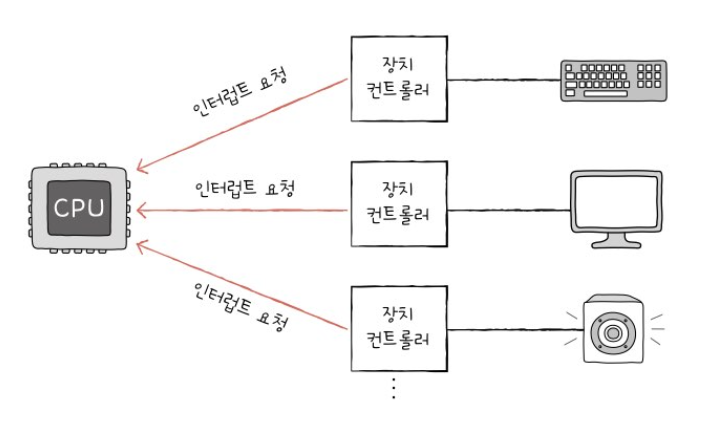

### 1. 순차적으로 처리하는 방법

인터럽트를 처리하는 도중 발생한 또 다른 인터럽트의 요청을 받아들이지 않고, 이미 처리중이던 인터럽트의 서비스 루틴이 모두 끝난 후, 새로 발생한 인터럽트의 서비스 루틴을 실행하는 방식이다.

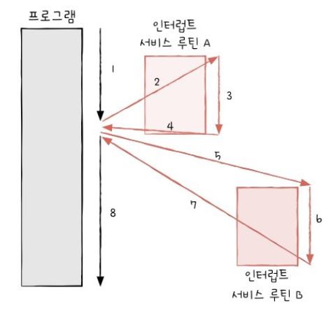

### 2. 우선순위대로 처리하는 방법

인터럽트를 처리하는 도중에 또 다른 인터럽트가 발생했다고 할 때, 새로 발생한 인터럽트의 우선 순위가 더 높다면 처리중이던 인터럽트의 실행을 잠시 멈추고, 새로 발생한 인터럽트를 먼저 처리하는 방식이다.

만약, 새로 발생한 인터럽트의 우선 순위가 더 낮다면 처리중이던 인터럽트의 실행을 모두 끝낸 뒤, 새로 발생한 인터럽트를 처리한다.

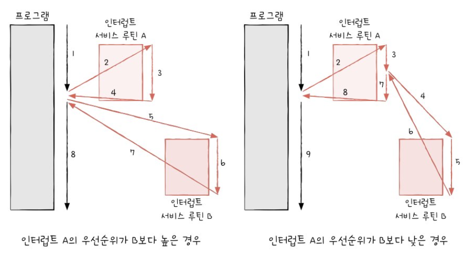

<aside>
✅ 플래그 레지스터 속 `인터럽트 비트를 비활성화`한 채 인터럽트를 처리하면 CPU는 `순차적으로` 인터럽트를 처리하게 된다.

</aside>
 
<aside>
✅ 플래그 레지스터 속 `인터럽트 비트를 활성화`한 채 인터럽트를 처리하거나, 인터럽트 비트를 비활성화해도  `NMI`가 발생한 경우 CPU는 `우선순위가 높은` 인터럽트부터 처리하게 된다.

</aside>
 
 
<aside>
📌 NMI : 플래그 레지스터 속 인터럽트 비트를 비활성화해도 무시할 수 없는 인터럽트

</aside>
 
 
<aside>
❓ 그렇다면 여러 인터럽트를 처리할 때, 우선순위는 누가 정하는 걸까?

</aside>
 
 
<aside>
💡 많은 컴퓨터에서 `PIC`라는 하드웨어를 사용한다.

</aside>

### PIC

: 여러 장치 컨트롤러에 연결되어 장치 컨트롤러에서 보낸 하드웨어 인터럽트 요청들의 우선순위를 판별한 뒤 CPU에게 지금 처리해야 할 하드웨어 인터럽트가 무엇인지 알려주는 장치이다.

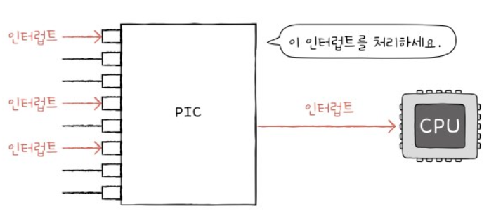

### PIC의 다중 인터럽트 처리 과정

1. PIC가 장치 컨트롤러에서 `인터럽트 요청 신호`를 받아들인다.
2. PIC는 인터럽트 우선순위를 판단한 뒤 CPU에 처리해야 할 `인터럽트 요청 신호`를 보낸다.
3. CPU는 PIC에 `인터럽트 확인 신호`를 보낸다.
4. PIC는 데이터 버스를 통해 CPU에 `인터럽트 벡터`를 보낸다.
5. CPU는 인터럽트 벡터를 통해 인터럽트 요청의 주체를 알게 되고, 해당 장치의 `인터럽트 서비스 루틴`을 실행한다.

<aside>
⭐ PIC가 NMI의 우선순위까지 판별하지는 않는다. PIC는 인터럽트 비트를 통해 막을 수 있는 하드웨어 인터럽트들의 우선순위만 조정한다.

</aside>

일반적으로, 더 많은 하드웨어 인터럽트를 관리하기 위해 PIC를 두 개 이상의 계층으로 구성한다.

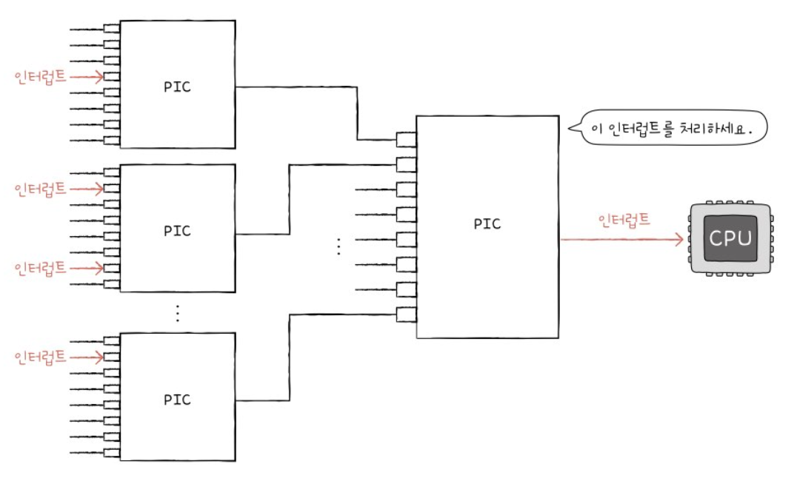

## 3. DMA 입출력
: 입출력장치와 메모리가 CPU를 거치지 않고 데이터를 주고받는 입출력 방식이다.
 
<aside>
✅ 앞서 살펴본, 프로그램 기반 입출력과 인터럽트 기반 입출력은 모두 메모리와 입출력장치 간의 데이터를 주고받는 과정에서 반드시 CPU를 거친다.
</aside>
 
 
입출력장치 데이터를 메모리에 저장하는 경우

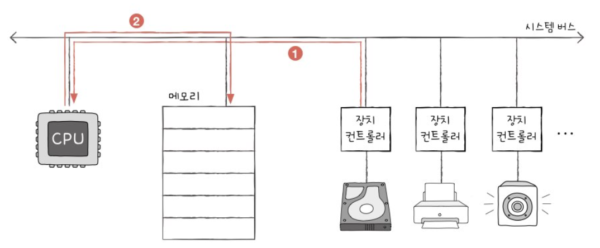

 
메모리 속 데이터를 입출력장치에 내보내는 경우

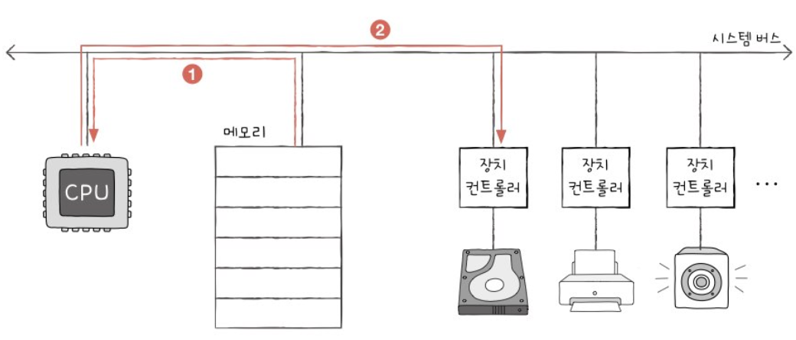

<aside>
❓ 이렇게 입출력장치와 메모리 사이에 전송되는 모든 데이터가 반드시 CPU를 거쳐야 한다면 CPU의 부담이 매우 커지게 되는데, CPU를 거치지 않는 방법은 없을까?

</aside>
 
 
<aside>
💡 그래서 등장한 것이 `DMA` 입출력 방식이다.

</aside>
 
 

DMA 입출력 방식을 위해서는 메모리에 직접 접근할 수 있는 `DMA 컨트롤러`라는 하드웨어가 필요하다.

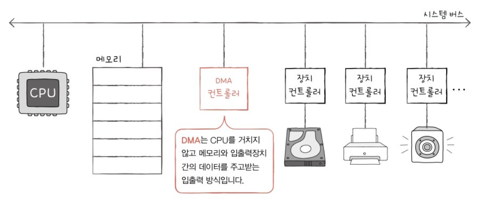

### DMA 입출력 과정

메모리 내의 정보를 하드 디스크에 백업하는 작업을 예시로, DMA 입출력이 어떻게 이루어지는지 알아보자.

1. CPU는 DMA 컨트롤러에 하드 디스크 주소, 수행할 연산(쓰기), 백업할 내용이 저장된 메모리의 주소 등의 정보와 함께 입출력 작업을 명령한다.
    
    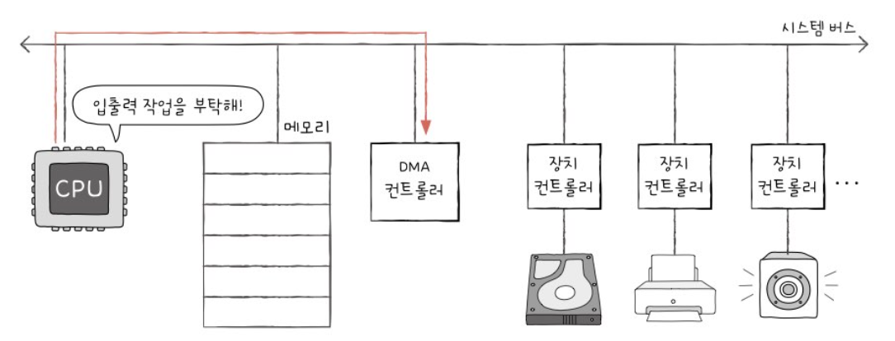
    

1. DMA 컨트롤러는 CPU를 거치지 않고, 메모리에서 직접 백업할 정보를 읽어오고, 메모리에서 읽어온 정보를 하드 디스크의 장치 컨트롤러에 내보낸다.
    
    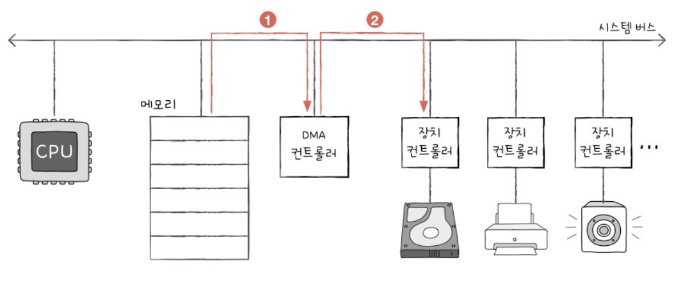
    

1. 백업이 끝나면 DMA 컨트롤러는 CPU에게 인터럽트를 걸어 작업이 끝났음을 알린다.
    
    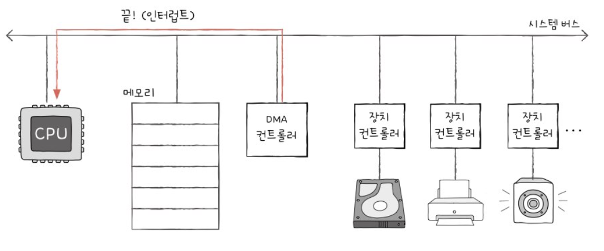
    

<aside>
✅ DMA 입출력 방식을 사용하면 CPU는 입출력의 시작과 끝에만 관여하므로, CPU의 부담이 훨씬 줄어들게 된다.

</aside>

### 시스템 버스

<aside>
❓ 시스템 버스는 공용 자원이기 때문에 CPU와 DMA 컨트롤러 둘 다 메모리나 장치 컨트롤러에 접근할 때 시스템 버스를 이용한다. 시스템 버스를 동시에 사용할 수는 없는데, 그럼 DMA 컨트롤러는 어떻게 시스템 버스를 사용하는걸까?

</aside>

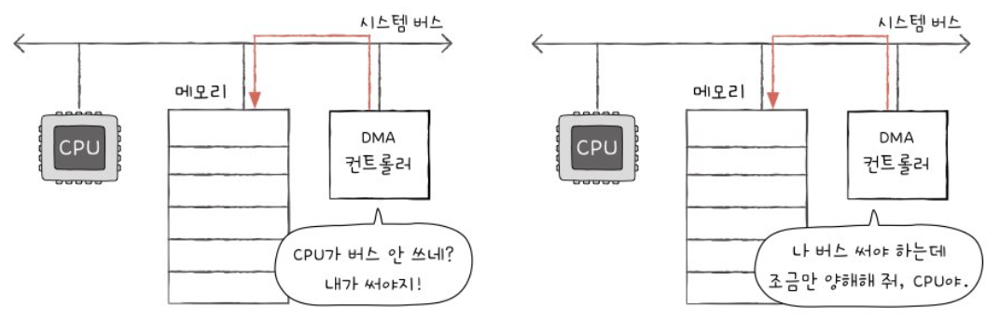

<aside>
💡 DMA 컨트롤러는 CPU가 시스템 버스를 이요하지 않을 때마다 조금씩 이용하거나, CPU가 일시적으로 시스템 버스를 이용하지 않도록 허락을 구하고, 사용한다.

</aside>
 
 
<aside>
📌 사이클 스틸링 : DMA의 시스템 버스 이용을 사이클 스틸링이라고 부른다.

</aside>

### 입출력 버스

DMA 입출력 방식에서 메모리와 입출력 장치 사이에 데이터를 주고 받으려면 시스템 버스를 두 번 사용해야 한다.

<aside>
❓ DMA가 시스템 버스를 사용하는만큼 CPU는 시스템 버스를 사용하지 못하는데, DMA의 시스템 버스 사용 빈도를 줄일 수는 없을까?

</aside>

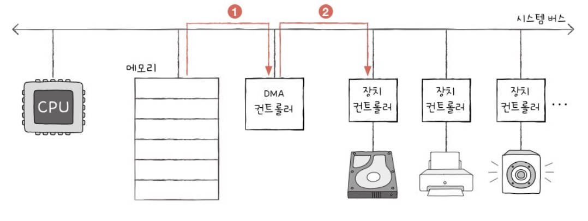

<aside>
💡 그 문제를 해결하기 위해 나온 것이 입출력 버스이다.

</aside>

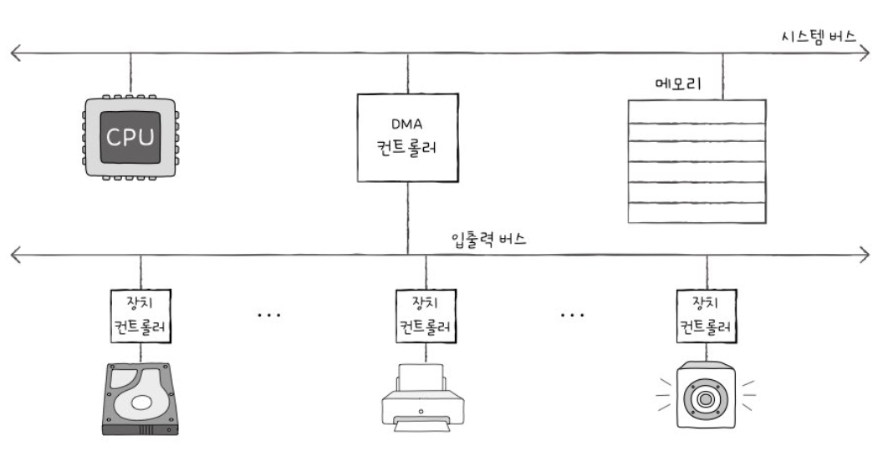

- 입출력 버스를 사용하면 DMA 컨트롤러와 장치 컨트롤러가 서로 데이터를 전송할 때는 시스템 버스를 이용하지 않아도 된다.
- 대부분의 입출력 장치는 시스템 버스가 아닌 입출력 버스와 연결된다.
- 입출력 장치들은 이렇게 입출력 버스와 연결되는 통로를 통해 시스템 버스를 타고, CPU와 정보를 주고받는다.
